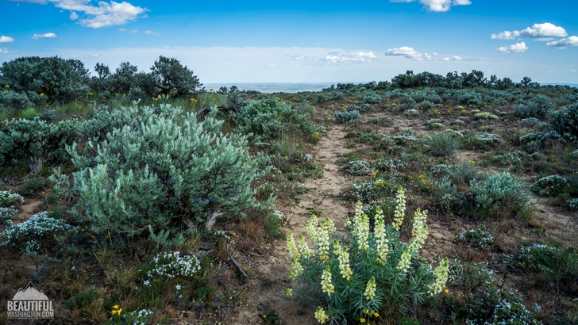

# pyroscope

This is Beezley trail, one of the shrublands 2.5 hour drive away from Seattle. Land managers need to know the fuel load of these shrubberies to make plans about wildfire initiatives. 

Nobody really collects data on the ground in these environments. Neither can they usually afford people to walk these trails and manually measure fuel loads. 

Pyroscope is a rover equipped with a depth camera, GPS, and thermal camera. It is designed to automate plot scale surface-fuel sampling for prescribed fire and AI fuel mapping. 

Pyroscope is small, lightweight, and maneuverable. This is in contrast to typical rovers that roam around the forest that are often larger and crush vegetation as it moves. 

The idea is that land managers will get a dashboard.

### Navigation

Navigation is led by Matthew Taruno. The biggest challenge is how we are able to navigate in forest environments using the tank rover, where the ground is often uneven, messy, and full of obstructions. 

The baseline approach developed is to use the ZED 2i Stereo Camera, which has a 2.1mm (110°) wide FOV and compatible with the NVIDIA Jetson Nano. 

Right now we aren't implementing this yet, but potentially: A neural network is trained to create a depth map, and this is fed into the steering algorithm to go to the goal location.

Mid-Level Obstacle Avoidance
- Local path planning using RRT* or A* on occupancy grid from stereo depth
- Dynamic window approach for real-time obstacle avoidance
- Recovery behaviors: back up and try alternate path if stuck. 

Low-Level Control
- Pure pursuit or model predictive control for path following
- Slope compensation using IMU data to maintain stability
- Consideration: Traction control to handle slippery surfaces (wet leaves, etc.)

For each plot in sequence:
  1. Plan global path to plot center
  2. Execute path with local obstacle avoidance:
     - Generate local occupancy grid from stereo depth
     - Use DWA to select safe velocity commands
     - Monitor IMU for dangerous slopes/tips
     - Execute recovery if progress stalls
  3. At plot center: stop, take photos, estimate fuel load
  4. Return to center using reverse path

### Perception
Percetion is led by Chenghao Wang. The perception system is responsible for taking downward-facing images of the fuel plots and estimating the surface fuel loads from these images.

### Hardware
Hardware is led by Annika An. 

### Evaluating Success
- Decision-ready plots per staff-day.
  - Plots that have (a) QC-passed images, (b) model fuel estimates, and (c) appear on a unit dashboard actually used by the planner.
  - Baseline (manual): ~14 plots/day.
  - MVP target (robot): ≥30 plots/day.
