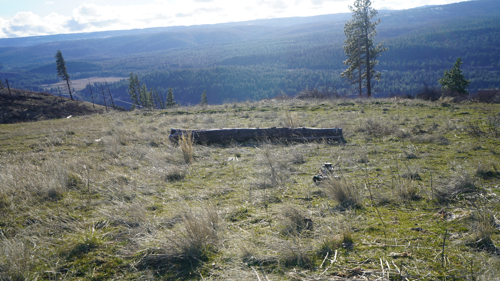
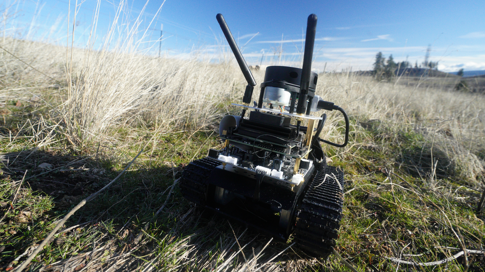

# pyroscope

This is a shrubland close to Ellensburg, WA, which is around a 2 hour drive away from Seattle. 



One problem that these land managers face are wildfires. In this area itself, there was a huge one in 2012 that burned much of the trees that make up the shrubland. Land managers need to know the fuel load of these shrubberies to make plans about wildfire initiatives. But they don't have the time to sit around and do that. Worse, nobody really collects data on the ground in these environments. Neither can they usually afford people to walk these trails and manually measure fuel loads. 

Now here's what we made to combat this problem:



Pyroscope is a rover equipped with a depth camera, GPS, and thermal camera. It is designed to automate plot scale surface-fuel sampling for prescribed fire and AI fuel mapping. 

Pyroscope is small, lightweight, and maneuverable. This is in contrast to typical rovers that roam around the forest that are often larger and crush vegetation as it moves. 

The idea is that land managers will get a dashboard that gives them near real time information of ground conditions; and get alerts of potential wildfire outbreaks.

Here is the architecture of Pyroscope:


### Navigation

The navigation system is built on ROS Melodic and runs across two machines: the Transbot (Jetson) handles hardware drivers and sensors, while a remote Ubuntu 18.04 PC runs navigation modules such as obstacle detection and high-level path planning.


Here's the simplest operation, teleooperating the robot: roslaunch transbot_ctrl transbot_keyboard.launch

Known environment issues:
- If there is no rospkg, do pip3 install rospkg


#### Demo

1. Place it in the dead center of the 3x3m square, facing along the longest open line (away from the obstacles). That gives it ~1.5m clearance to every wall, so:
  - The costmap initializes with free space all around
  - The first waypoint plan has room to route
  - If recovery triggers (rotate in place), it won't sweep into a wall

Also, set the origin so waypoints start from the center rather than from a corner near a wall:
roslaunch pyroscope_navigation coverage_mission_nav.launch \
    area_width:=2 area_height:=2 \
    origin_x:=-1.0 origin_y:=-1.0

This centers the 2x2m coverage grid around the robot's starting position (0,0 in odom frame) instead of starting from corner (0,0) and going to (2,2) -- which would put
  half the waypoints near the far walls.

For the getting-stuck-on-walls problem, the robot should recover on its own now with the reduced inflation. But if it does get stuck again, you can cancel the current goal without killing everything:

rostopic pub -1 /move_base/cancel actionlib_msgs/GoalID '{}'

This tells move_base to stop pursuing the current waypoint. The coverage planner will then time out and move to the next one -- no need to physically touch the robot.


#### Coverage Path Planning
- Boustrophedon (lawnmower) pattern covers a configurable rectangular area (default 10m x 10m, 1m spacing)
- Pauses 3 seconds at each waypoint for thermal camera capture (`/coverage/capture_ready`)
- Publishes mission progress to `/coverage/progress`

To launch this coverage mission:
1. roscore (on remote PC)
2. roslaunch transbot_bringup bringup.launch (on Transbot)
3. roslaunch rplidar_ros rplidar.launch (on Transbot)
4. roslaunch transbot_nav navigation.launch map_file:=$(rospack find transbot_nav)/maps/pyroscope_map.yaml (on remote PC)
5. rviz
6. Make sure that you source the devel/setup.bash
7. roslaunch pyroscope_navigation coverage_mission.launch
8. roslaunch pyroscope_navigation coverage_mission.launch \
    area_width:=5.0 \
    area_height:=5.0 \
    row_spacing:=0.8 \
    waypoint_spacing:=0.5 \
    origin_x:=0.0 \
    origin_y:=0.0 \
    dwell_time:=2.0 \
    waypoint_timeout:=30.0

Testing the odometry:
timeout 3 rostopic pub /cmd_vel geometry_msgs/Twist '{linear: {x: 0.3}}'

If you want to publish zero velocity in attempt to stop the robot:
`rostopic pub -1 /cmd_vel geometry_msgs/Twist '{linear: {x: 0, y: 0, z: 0}, angular: {x: 0, y: 0, z: 0}}`

Monitoring:
7. rostopic echo /coverage/progress
8. rostopic echo /coverage/complete
9. rostopic echo/nav/goal_reached
10. rostopic hz /scan
11. rosrun tf view_frames && evince frames.pdf

rosrun tf static_transform_publisher 0 0 0.15 0 0 0 base_link laser 100 &

rosrun tf tf_monitor

Make sure odometry is working:
# Terminal 1: Start teleop keyboard
roslaunch transbot_ctrl transbot_keyboard.launch

# Terminal 2: Watch X position
rostopic echo /odom --filter "print('x:', m.pose.pose.position.x, '  y:', m.pose.pose.position.y)"

# Drive forward with keyboard (W key or up arrow)
# Watch the terminal

Expected behavior:
- ✅ X value increases as you drive forward → Odometry works!
- ❌ X value stays at 0.0 → Odometry broken!

#### Obstacle Avoidance (move_base + costmaps)

The coverage mission uses ROS `move_base` with DWA local planning and rolling-window costmaps to navigate around obstacles in real time. No pre-built map is required -- the costmaps are built live from lidar data.

- **Global costmap** -- 15x15m rolling window in the `odom` frame. NavfnROS plans a path from robot to each waypoint.
- **Local costmap** -- 4x4m rolling window. DWA local planner samples velocity trajectories and picks the best one that avoids obstacles.
- **Inflation layer** -- expands detected obstacles by 0.25m so the robot keeps a safe buffer.

#### How the planner works step by step

The full planning pipeline runs continuously while the robot drives to each waypoint:

```
 /scan (lidar)
    |
    v
 +---------------------+
 | Costmap Obstacle     |  Marks cells as LETHAL (254) where lidar hits
 | Layer                |  Clears cells along raytrace (no obstacle there)
 +---------------------+
    |
    v
 +---------------------+
 | Costmap Inflation    |  Expands every lethal cell outward by 0.25m
 | Layer                |  Gradient: lethal (254) -> 0 over the radius
 +---------------------+  Robot footprint fits? Safe. Overlaps inflation? Penalized.
    |
    v
 +--+------------------+     +---------------------+
 | Global Costmap      |     | Local Costmap       |
 | (15m x 15m)         |     | (4m x 4m)           |
 | Rolling window      |     | Rolling window      |
 | Updates at 2 Hz     |     | Updates at 5 Hz     |
 +---------------------+     +---------------------+
    |                              |
    v                              v
 +---------------------+     +---------------------+
 | NavfnROS            |     | DWA Local Planner   |
 | (Global Planner)    |     |                     |
 | Dijkstra on the     |     | 1. Sample velocities|
 | global costmap grid |     |    (vx, vtheta)     |
 | Plans full path     |     | 2. Simulate 2.0s    |
 | from robot to goal  |     |    forward          |
 | Replans at 1 Hz     |     | 3. Score each:      |
 +---------------------+     |    - path follow: 20|
    |                         |    - goal progress:32|
    | global path             |    - obstacle dist:  |
    v                         |      0.05           |
 +---------------------+     | 4. Pick best        |
 | DWA follows the     |<----+    collision-free    |
 | global path but     |     |    trajectory       |
 | adapts locally      |     | 5. Publish /cmd_vel |
 +---------------------+     |    at 5 Hz          |
                              +---------------------+
```

**Costmap cell values:**
- 254 = lethal (obstacle detected here, do not enter)
- 253 = inscribed (robot center here = collision)
- 1-252 = inflation gradient (higher = closer to obstacle = more costly)
- 0 = free space

**Example: robot approaches a wall at waypoint (2, 0)**
1. Lidar sees wall at 1.5m ahead
2. Obstacle layer marks those cells as 254 in both costmaps
3. Inflation layer expands the wall by 0.25m with a cost gradient
4. NavfnROS runs Dijkstra -- the cheapest global path now curves around the wall
5. DWA samples 12 forward speeds x 20 rotation speeds = 240 candidate trajectories
6. Trajectories that pass through inflated cells get penalized by `occdist_scale`
7. Trajectories that collide with lethal cells are rejected entirely
8. The winning trajectory curves the robot away from the wall toward the goal
9. If no collision-free trajectory exists, move_base triggers recovery (rotate in place to clear costmap, then retry)
10. If recovery fails, move_base aborts and coverage_planner skips to the next waypoint

**Why the robot should never hit a wall:**
- The inflation radius (0.25m) is larger than the robot's half-width (0.125m)
- DWA will not select any trajectory that enters the inscribed radius
- Even if the global path passes near a wall, DWA locally avoids it
- The costmap updates at 5 Hz from live lidar, so new obstacles are seen within 200ms

**Prerequisites (install once on the remote PC):**

```bash
sudo apt install ros-melodic-move-base ros-melodic-dwa-local-planner \
  ros-melodic-navfn ros-melodic-move-base-msgs
```

**To launch the coverage mission with obstacle avoidance:**

1. roscore (on remote PC)
2. roslaunch transbot_bringup bringup.launch (on Transbot)
3. roslaunch rplidar_ros rplidar.launch (on Transbot)
4. source ~/pyroscope/catkin_ws/devel/setup.bash (on remote PC)
5. roslaunch pyroscope_navigation coverage_mission_nav.launch \
    area_width:=3.0 \
    area_height:=3.0 \
    row_spacing:=1.0 \
    waypoint_spacing:=1.0

Note: steps 2-3 provide `/odom`, `/scan`, and the `odom -> base_link` TF that move_base requires. The launch file adds the `base_link -> laser` static TF.

**Verify move_base is running:**

```bash
rostopic list | grep move_base
```

Should see `/move_base/status`, `/move_base/global_costmap/costmap`, `/move_base/local_costmap/costmap`

```bash
rosrun tf tf_monitor
```

Should show the full chain: `odom -> base_link -> laser`

**Monitor mission progress:**

```bash
rostopic echo /coverage/progress
rostopic echo /move_base/status
```

**Rviz visualization:**

Open rviz and set Fixed Frame to `odom`. Add these displays:

| Display    | Topic                                        | What it shows                              |
| ---------- | -------------------------------------------- | ------------------------------------------ |
| LaserScan  | `/scan`                                      | Raw lidar points                           |
| Map        | `/move_base/local_costmap/costmap`           | 4x4m obstacle grid around robot            |
| Map        | `/move_base/global_costmap/costmap`          | 15x15m planning grid                       |
| Path       | `/move_base/NavfnROS/plan`                   | Global planned route (green)               |
| Path       | `/move_base/DWAPlannerROS/local_plan`        | Local DWA trajectory (red)                 |
| Pose       | `/move_base/current_goal`                    | Current target waypoint                    |

Place an object between the robot and the next waypoint -- you should see the costmap light up and the local path curve around it.

**Troubleshooting:**

- "Cannot launch node of type move_base/move_base" -- run the `sudo apt install` line above
- "Waiting for move_base action server..." then aborts -- check `rosnode list` for `/move_base` and terminal output for TF or `/scan` errors
- Robot spinning in place -- goal may be inside an inflated obstacle. Check the costmap in rviz
- Global planner fails -- waypoint may be outside the 15m costmap window. The planner warns at startup if consecutive waypoints exceed 7.5m

#### Legacy Obstacle Avoidance (coverage_mission.launch)

The original `coverage_mission.launch` is still available as a fallback. It uses a simpler approach with no path planning:
- **Lidar obstacle detector** -- monitors the front +/-30 deg arc of the RPLidar scan. Publishes `/obstacle_detected` when anything is within 0.30m
- **Safety stop** -- overrides `/cmd_vel` with a stop command whenever an obstacle is detected
- The robot stops on obstacle detection and skips the waypoint after 5 seconds

#### Key Launch Files
| Launch File                                          | Description                                              |
| ---------------------------------------------------- | -------------------------------------------------------- |
| `transbot_slam/slam_gmapping.launch`                 | Build a map with GMapping                                |
| `transbot_nav/navigation.launch`                     | AMCL + move_base navigation with a saved map             |
| `pyroscope_navigation/coverage_mission_nav.launch`   | Coverage mission with move_base obstacle avoidance       |
| `pyroscope_navigation/coverage_mission.launch`       | Coverage mission with simple stop-on-obstacle (legacy)   |
| `pyroscope_navigation/obstacle_avoidance.launch`     | Standalone obstacle avoidance layer                      |
| `transbot_ctrl/transbot_keyboard.launch`             | Keyboard teleoperation                                   |

#### ZED 2i Testing
Simple hardware test:
1. Plug the ZED 2i into a USB 3.0 port
2. Run lsusb - you should see the camera listed as a USB device
3. Check USB connection: dmesg | tail after plugging in

With SDK installed:
1. Download ZED SDK (make sure it's the right version for the Jetson)
2. Install prerequisites: sudo apt install zstd
3. Install the SDK following their installer
4. Run test tools:
  - ZED_Explorer - GUI tool to test camera
  - ZED_Depth_Viewer - View depth output
  - Run sample applications in /usr/local/zed/tools/

### Backend

Instructions for setting up the backend:
1. Install MySQL (using MySQL 8.0 for Ubuntu 18.04)
2. ...

To test from the backend:
                                                                                  
1. Start the backend                                                             
  cd /Users/matthewtaruno/Dev/pyroscope/application/backend
  python run.py

2. Start a mission via API
  curl -X POST http://localhost:8000/api/robot/mission/start \
    -H "Content-Type: application/json" \
    -d '{"area_width": 10.0, "area_height": 10.0, "row_spacing": 1.0,
  "waypoint_spacing": 1.0}'

3. Check status
  curl http://localhost:8000/api/robot/mission/status

4. Stop mission
  curl -X POST http://localhost:8000/api/robot/mission/stop


### Perception
Percetion is led by Chenghao Wang. The perception system is responsible for taking downward-facing images of the fuel plots and estimating the surface fuel loads from these images.

### Hardware + Design
This is led by Annika An. She designed the hardware for the robot, putting together the Lidar, cameras, and other sensors. She also designed the front-end dashboard for the robot.

### Evaluating Success
- Decision-ready plots per staff-day.
  - Plots that have (a) QC-passed images, (b) model fuel estimates, and (c) appear on a unit dashboard actually used by the planner.
  - Baseline (manual): ~14 plots/day.
  - MVP target (robot): ≥30 plots/day.


